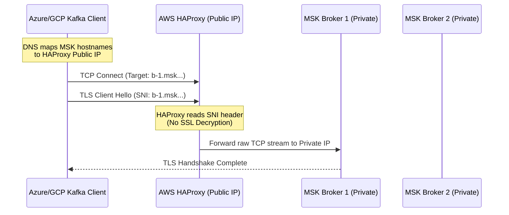

# AWS MSK Cross-Cloud Proxy (HAProxy SNI Routing)

This repository demonstrates an advanced networking architecture for securely routing Apache Kafka traffic from external cloud providers (Azure, GCP, OCI) into private Amazon MSK (Managed Streaming for Apache Kafka) brokers without requiring a Site-to-Site VPN or AWS Transit Gateway.

## The Problem

Amazon MSK brokers are deployed within a private AWS VPC. When an external Kafka client connects, the bootstrap servers return the private DNS/IP addresses of the brokers (e.g., `b-1.proddevopsmskcluster...`). External clients on the public internet or in other clouds cannot resolve or route traffic to these private addresses, resulting in immediate connection timeouts.

Standard Network Load Balancers (NLBs) cannot solve this on their own, because Kafka clients require direct, distinct connections to each individual broker after the initial bootstrap phase.

## The Solution: TCP SNI Routing

This architecture utilizes **HAProxy in raw TCP mode** deployed on a public-facing EC2 instance. It solves the routing issue using **TLS Server Name Indication (SNI)** inspection.

1. **Local DNS Override:** The external Kafka client overrides its local DNS (via `/etc/hosts`) to point all MSK broker hostnames to the Public IP of the HAProxy instance.
2. **SNI Inspection:** When the client initiates a secure TLS (SSL) connection, it sends an unencrypted "Client Hello" packet containing the target broker's hostname in the SNI header.
3. **Dynamic Forwarding:** HAProxy intercepts this packet, reads the SNI header, and dynamically forwards the raw TCP stream directly to the corresponding private MSK broker.
4. **End-to-End Encryption:** HAProxy does *not* terminate the SSL connection. It acts as a pure TCP passthrough, ensuring that end-to-end encryption is maintained from the client directly to the MSK broker.

## Architecture Diagram



## Configuration Setup

### 1. External Client Setup
On the external application server (Azure, GCP, etc.), update the `/etc/hosts` file to map the private MSK broker DNS names to the HAProxy instance's Elastic IP.

```text
# /etc/hosts
<HAPROXY_PUBLIC_IP> b-1.proddevopsmskcluster.7vvz9u.c3.kafka.ap-south-1.amazonaws.com
<HAPROXY_PUBLIC_IP> b-2.proddevopsmskcluster.7vvz9u.c3.kafka.ap-south-1.amazonaws.com
<HAPROXY_PUBLIC_IP> b-3.proddevopsmskcluster.7vvz9u.c3.kafka.ap-south-1.amazonaws.com
```

### 2. HAProxy Server Setup
Deploy an EC2 instance in a Public Subnet (e.g., Ubuntu or Amazon Linux) and install HAProxy.

```bash
sudo apt update
sudo apt install haproxy -y
```

Apply the configuration file provided in `haproxy.cfg` and restart the service:

```bash
sudo systemctl restart haproxy
sudo systemctl status haproxy
```
